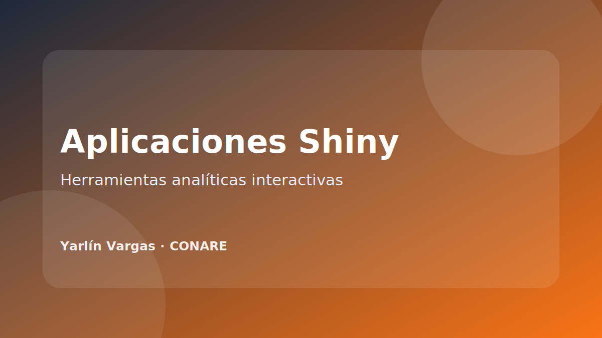

{.project-cover}

## Resumen

Conjunto de aplicaciones interactivas desarrolladas en R Shiny para facilitar la exploración de bases de datos, visualización de indicadores y generación de productos analíticos.

## Propósito

Crear herramientas que permitan a equipos técnicos y no técnicos interactuar con datos sin necesidad de modificar código directamente, manteniendo trazabilidad y criterios de análisis reproducible.

## Tipos de aplicaciones documentadas

- Dashboards de indicadores.
- Herramientas de auditoría de bases.
- Generadores de gráficos.
- Interfaces para explorar variables y filtros.
- Aplicaciones para descarga de reportes.

## Competencias demostradas

- Diseño de interfaz de usuario.
- Programación reactiva en Shiny.
- Validación de entradas.
- Manejo de errores.
- Exportación de resultados.
- Documentación para usuarios finales.

## Tecnologías

R, Shiny, bslib, shinydashboard, tidyverse, ggplot2, DT, plotly, readxl, openxlsx y Quarto.

## Próximos pasos

Agregar capturas, enlaces internos o repositorios privados/públicos según la política institucional aplicable.
