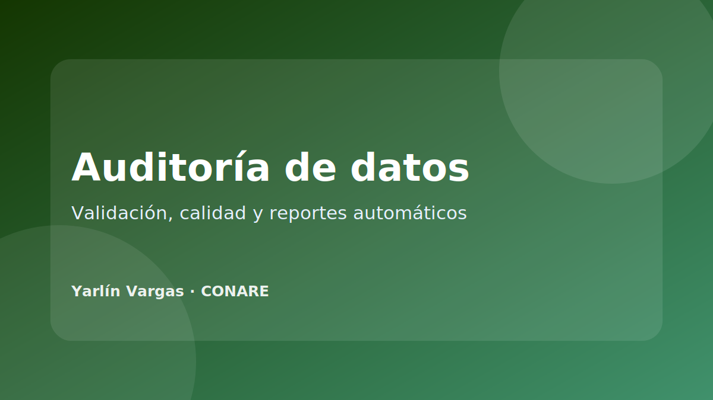

{.project-cover}

## Resumen

Herramienta desarrollada para apoyar procesos de revisión, validación y auditoría de bases de datos. Su objetivo es reducir trabajo manual, identificar problemas de calidad y facilitar la generación de reportes técnicos.

## Problema que resuelve

En proyectos de investigación suele recibirse información en diferentes formatos, con problemas de nombres de variables, valores faltantes, categorías inconsistentes, tipos de datos incorrectos o errores de carga. Una herramienta de auditoría permite revisar estos aspectos de forma sistemática antes de iniciar el análisis.

## Funcionalidades principales

- Carga de bases de datos.
- Revisión de estructura de variables.
- Identificación de valores faltantes.
- Validación de tipos de datos.
- Detección de posibles inconsistencias.
- Generación de reportes automáticos.
- Exportación de resultados para revisión técnica.

## Tecnologías

| Componente | Herramientas |
|---|---|
| Interfaz | Shiny, bslib, shinydashboard |
| Procesamiento | R, tidyverse, janitor |
| Reportes | R Markdown / Quarto |
| Exportación | openxlsx, writexl, officer |

## Mi contribución

- Diseño del flujo de auditoría.
- Programación de funciones de revisión y validación.
- Construcción de interfaz interactiva.
- Documentación de resultados y generación de reportes.
- Pruebas con bases reales y corrección de errores.

## Resultado

La herramienta permite estandarizar revisiones de calidad de datos, reducir tiempos de revisión manual y dejar evidencia documentada de los problemas encontrados en cada base.
