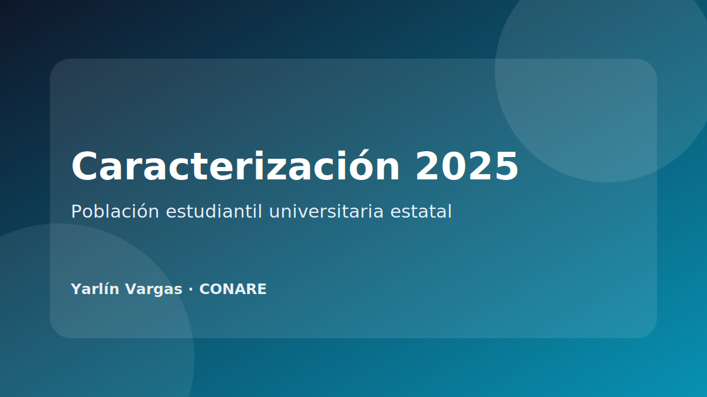

{.project-cover}

## Resumen

Producto público del OLaP orientado a presentar resultados sobre la caracterización de la población estudiantil universitaria estatal en 2025. Este proyecto permite documentar experiencia en procesamiento de encuestas, construcción de indicadores, análisis por universidad y presentación de resultados para la toma de decisiones.

[Ver publicación oficial en OLaP](https://olap.conare.ac.cr/documentosolap/resultados-de-caracterizacion-de-la-poblacion-estudiantil-universitaria-estatal-2025/)

## Ficha técnica

| Campo | Descripción |
|---|---|
| Institución | CONARE / Observatorio Laboral de Profesionales |
| Tema | Caracterización de población estudiantil universitaria estatal |
| Año | 2025 |
| Tipo de producto | Publicación / producto institucional |
| Estado | Publicado |

## Problema que aborda

La caracterización permite describir quiénes conforman la población estudiantil de las universidades estatales y generar información útil para seguimiento institucional, análisis de condiciones estudiantiles y procesos de planificación.

## Variables y dimensiones posibles

- Sexo.
- Estado civil.
- Discapacidad.
- Grupo étnico.
- Residencia y convivencia.
- Situación económica.
- Fuentes de financiamiento.
- Primer ingreso.
- País de nacimiento.

## Mi contribución documentable

::: {.callout-note}
Ajustar esta sección con el rol exacto desempeñado en el producto antes de publicar el sitio.
:::

- Limpieza, depuración y estructuración de bases de datos.
- Cálculo de frecuencias, porcentajes e indicadores por universidad.
- Elaboración de tablas y visualizaciones.
- Revisión de consistencia entre bases, categorías y resultados.
- Apoyo en comunicación de resultados mediante productos gráficos.

## Herramientas y competencias aplicadas

- R y tidyverse.
- Tablas reproducibles.
- Visualización institucional.
- Validación de categorías.
- Análisis descriptivo de encuestas.

## Evidencia pública

La evidencia disponible corresponde al enlace oficial del producto en el sitio del OLaP.
