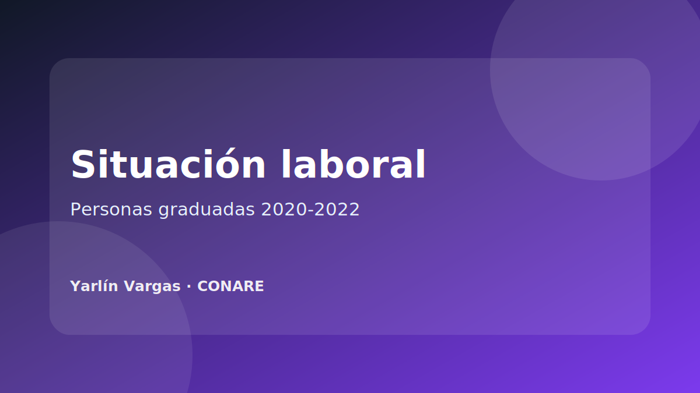

{.project-cover}

## Resumen

Producto público del OLaP sobre la situación laboral de las personas graduadas 2020-2022 de universidades costarricenses. Esta ficha registra el producto dentro del portafolio profesional como experiencia vinculada a análisis de mercado laboral, seguimiento de graduados e indicadores para educación superior.

[Ver publicación oficial en OLaP](https://olap.conare.ac.cr/documentosolap/situacion-laboral-personas-graduadas-2020-2022-universidades-costarricenses/)

## Ficha técnica

| Campo | Descripción |
|---|---|
| Institución | CONARE / Observatorio Laboral de Profesionales |
| Tema | Inserción y situación laboral de personas graduadas |
| Periodo de cohorte | 2020-2022 |
| Tipo de producto | Publicación / producto institucional |
| Estado | Publicado |

## Problema que aborda

El seguimiento laboral de personas graduadas permite analizar condiciones de inserción, empleo, vinculación entre formación y trabajo, y resultados asociados a la educación superior.

## Mi contribución documentable

::: {.callout-note}
Ajustar esta sección con el rol exacto desempeñado en el producto antes de publicar el sitio.
:::

- Apoyo en procesamiento de bases de datos.
- Validación de indicadores y categorías.
- Construcción o revisión de cuadros y visualizaciones.
- Sistematización de resultados para productos institucionales.
- Comunicación de hallazgos de forma clara y ordenada.

## Herramientas y competencias aplicadas

- Análisis de encuestas.
- Indicadores laborales.
- Visualización de datos.
- Control de calidad y consistencia.
- Documentación técnica.

## Evidencia pública

La evidencia disponible corresponde al enlace oficial del producto en el sitio del OLaP.
