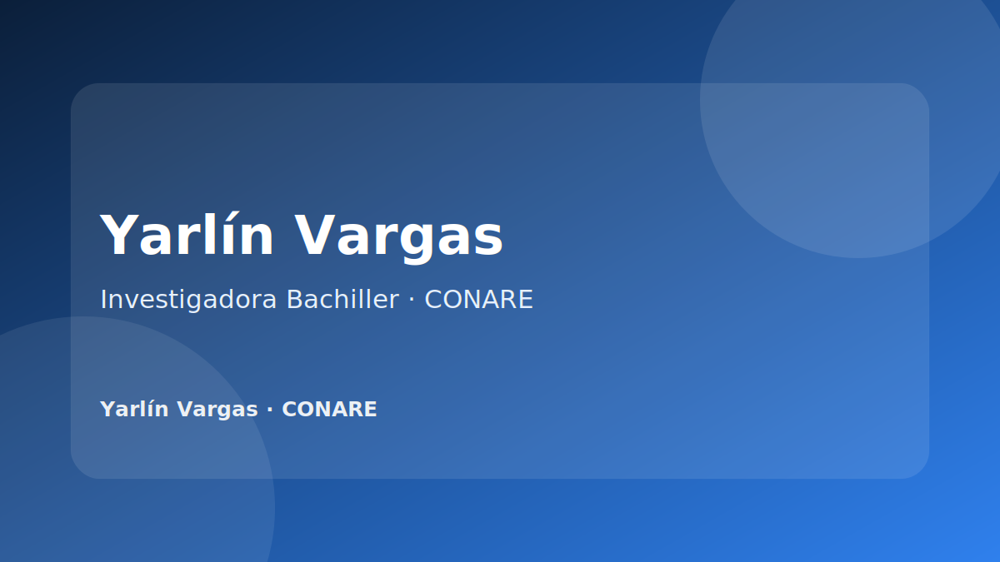

{.project-cover}

Soy **Yarlín Paola Vargas Valverde**, investigadora bachiller con formación en Estadística. Mi experiencia combina investigación aplicada, análisis de bases de datos, metodología de encuestas, visualización de información y desarrollo de soluciones analíticas con R, Shiny, Quarto, Power BI y Excel.

Actualmente documento mi trabajo profesional en CONARE y el Programa Estado de la Nación mediante productos, herramientas y publicaciones institucionales. Mi interés principal es construir soluciones que hagan que los datos sean más comprensibles, verificables y útiles para procesos de investigación y toma de decisiones.

## Áreas de trabajo

::: {.card-grid}
::: {.port-card}
### Investigación aplicada
Diseño metodológico, análisis estadístico, sistematización de resultados y apoyo en informes técnicos.
:::

::: {.port-card}
### Ciencia de datos
Procesamiento, limpieza, depuración, integración y validación de bases de datos provenientes de distintas fuentes.
:::

::: {.port-card}
### Visualización y comunicación
Construcción de gráficos, dashboards, reportes y productos de divulgación para audiencias técnicas y no técnicas.
:::

::: {.port-card}
### Automatización
Desarrollo de aplicaciones, plantillas y flujos reproducibles en R, Shiny, R Markdown y Quarto.
:::
:::

## Perfil resumido

Analista e investigadora con capacidad para traducir información estadística en productos claros y accionables. Cuento con experiencia en el procesamiento de encuestas, registros administrativos y bases institucionales, así como en el diseño de herramientas para automatizar tareas de auditoría, visualización y generación de reportes.

## Principios de trabajo

- Claridad metodológica.
- Reproducibilidad del análisis.
- Calidad y trazabilidad de datos.
- Comunicación visual comprensible.
- Documentación ordenada de procesos.
